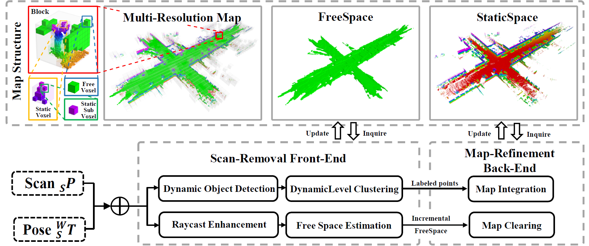

# FreeDOM

[](https://arxiv.org/abs/2504.11073)
[](https://youtu.be/5w5p5S4NJ4E)
[](https://www.bilibili.com/video/BV1tg5vzeE8d/?share_source=copy_web&vd_source=3ece63e96c4dbae46c3c2b13028ec6c8)



**FreeDOM** is an online dynamic object removal framework for static map construction based on conservative free space estimation. With FreeDOM, you can create static voxel and pointcloud map in real-time, free from dynamic object interference.

## ROS 2 Humble

This branch (`ros2-humble`) is a port of the upstream ROS 2 Jazzy version to **ROS 2 Humble**. Compared with the Jazzy branch:

- `cv_bridge` header switched to `cv_bridge/cv_bridge.h` (Humble does not ship the `.hpp` variant).
- `evaluate_tools/` (`ground_truth_generate`, `static_map_evaluate`) ported from ROS 1 to `rclcpp`; their `.launch` files replaced with `.launch.py`.
- Legacy ROS 1 entry-point launches (`run_freedom.launch`, `run_freedom_indoor.launch`) removed; `run_freedom_indoor.launch.py` added.
- `package.xml` dependency declarations brought in line with `CMakeLists.txt`.
- Removed the obsolete `include/freedom/` header tree.

We have tested it on Ubuntu 22.04 + ROS 2 Humble.

## 1. Build

Clone source code:
```bash
mkdir -p ./Freedom_ws/src
cd ./Freedom_ws/src
git clone https://github.com/qza36/FreeDOM -b jazzy
```
Build:
```bash
cd ..
colcon build
```

## 2. Run
Run experiments on the SemanticKITTI dataset:
```bash
source install/setup.bash
ros2 launch freedom run_freedom.launch.py
ros2 bag play DATASET.bag
```
All rosbags can be found [here](https://drive.google.com/drive/folders/1fIDHxXvzVftwmE3uOejQGbytoBfeMTMA?usp=sharing). To run experiments on other datasets (HeLiMOS, Indoor), modify the `yaml` file path in `run_freedom.launch.py` and play the corresponding rosbag.

- When running KITTI seq.01 (high-speed scenario), `counts_to_free` should be set to 3 to enable faster free space estimation.

- It is recommended to use `run_freedom_indoor.launch.py` for Indoor datasets for better visualization.

Save the generated static map:
```bash
ros2 topic pub /save_map std_msgs/msg/Empty "{}" -1
```
The static map will be saved by default at `./generated_pcd`.

## 3. Evaluation
Generate ground truth:
```bash
ros2 launch freedom ground_truth_generate.launch.py
ros2 bag play DATASET.bag
```
Save the generated ground truth:
```bash
ros2 topic pub /save_map std_msgs/msg/Empty "{}" -1
```
The ground truth file will be saved by default at `./generated_pcd`.

- Alternatively, you can directly download the ground truth file [here](https://drive.google.com/drive/folders/1fIDHxXvzVftwmE3uOejQGbytoBfeMTMA?usp=sharing).

Evaluation:
```bash
ros2 launch freedom static_map_evaluate.launch.py
```
- Make sure the `ground_truth_path` and `static_map_path` in `static_map_evaluate.launch.py` are correct.

- Note that we use a voxel size of 0.2m for outdoor datasets and 0.1m for indoor datasets, which can be modified in `ground_truth_generate.launch.py` and `static_map_evaluate.launch.py`.


## 4. Citation
Please cite this paper if you find our work useful for your research.
```
@article{Li2025FreeDOM,
  author={Li, Chen and Li, Wanlei and Liu, Wenhao and Shu, Yixiang and Lou, Yunjiang},
  journal={IEEE Robotics and Automation Letters}, 
  title={FreeDOM: Online Dynamic Object Removal Framework for Static Map Construction Based on Conservative Free Space Estimation}, 
  year={2025},
  volume={10},
  number={6},
  pages={5577-5584},
  doi={10.1109/LRA.2025.3560881}
}
```
